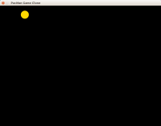
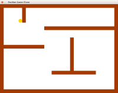
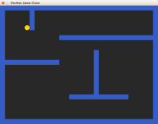
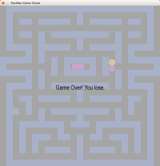
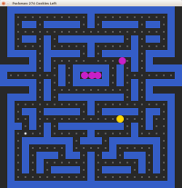
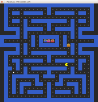

# Клон игры PacMan на SFML по шагам

В этих примерах описано создание клона игры шаг за шагом. Код написан на C++ в процедурном стиле для максимально лёгкого чтения. Для сборки примеров потребуется CMake, C++ компилятор (G++, Clang или MSVC) и библиотека SFML.

# Создаём MVP (Minimal Viable Product)

## Слой №1: неподвижный шарик

В [1-м примере](pacman_1) в программе будет заложен основной цикл игры.

## Слой №2: управление персонажем

Во [2-м примере](pacman_2) добавлено управление персонажем с помощью клавиш-стрелок.

## Слой 3: стены и проходы лабиринта

В [3-м примере](pacman_3) добавлены стены и проходы лабиринта, но пока ещё нет обработки столкновений.

## Слой 4: обработка столкновений

[4-й пример](pacman_4) покажет, как реализовать базовую обработку столкновений (англ. collisions) со стенами лабиринта.

## Слой 5: призраки и поражение

В [5-м примере](pacman_5) появится возможность проиграть в случае, если PacMan столкнётся с призраком.

## Слой 6: печенье и победа

В [6-м примере](pacman_6) мы добавим печенье, которое пакман должен поедать, и реализуем возможность победы.

# После MVP: улучшаем и полируем проект

## Слой 7: улучшаем пакмана

В [7-м примере](pacman_7) мы добавим пакману ракрывающийся рот и правдоподобную анимацию движения.

## Слой 8: улучшаем призраков

В [8-м примере](pacman_8) мы увидим врага в лицо: каждому призраку будет обеспечено собственное изображение, с анимацией, указывающей направление движения.

